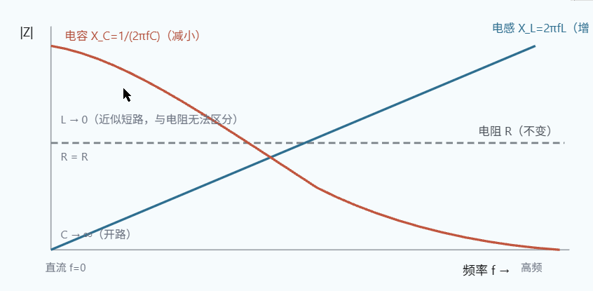
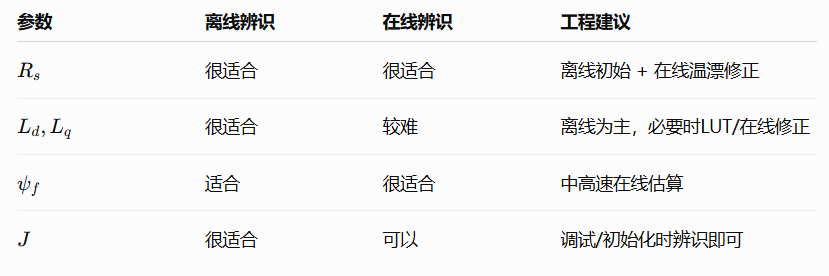
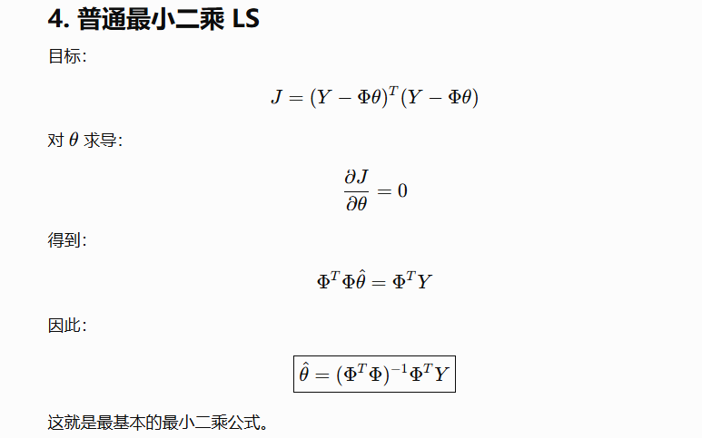
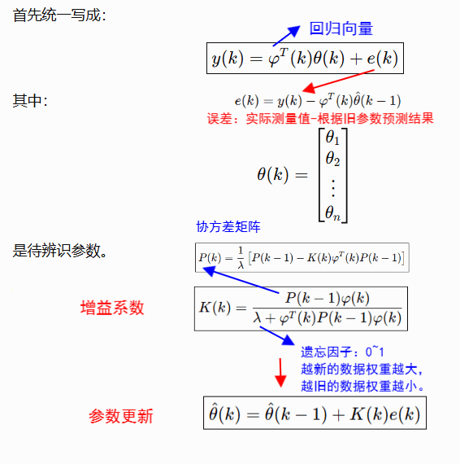
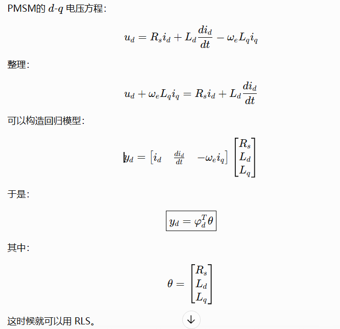

# 参数辨识

### 为什么进行参数辨识？

　　在控制系统中用到电机参数的地方有**转速环前馈补偿（解耦）** 、**电流环PI控制器**、MTPA /弱磁控制、无感控制等。

- 电子电阻：受到温升影响会增大，影响电流环、响应差。
- 电感：会受到磁饱和减小，影响解耦、产生转矩脉动。
- 磁链：会随温升减小，转矩估算错误、MTPA失效

## 一、离线辨识

#### 电机得基本参数包括：

- **电气参数**：定子电阻 $R_s$、d/q轴电感 $L_d,L_q$、永磁磁链 $\psi_f$、反电动势
- **机械参数**：转动惯量 $J$、粘性阻尼 $B$、负载转矩 TL

　　初次调试时采用，精度高。

#### 定子电阻辨识---直流注入法

　　电机静止时，给某一相注入直流电压（根据母线电压和实际占空比估计相电压）、根据**欧姆定律**解算相电阻。由于是星形连接，所以测的是两相的电阻值，单相电阻还需要除以二。多次测量取均值

　　通过材料的温度系数也可以去估算绕组温度。

```c
/**
 * 直流注入法辨识 Rs
 * 
 * @return 辨识的电阻值（Ω）
 */
float Identify_Rs_DCI(void) {
    const float Idc_target = 2.0f;  // 2A 直流电流
    const float dt = 0.0001f;       // 10kHz
    const int samples = 100;        // 采样次数
    
    // 1. 禁用 PWM
    PWM_Disable();
    HAL_Delay(10);
    
    // 2. 给定 d 轴电流（a 相方向）
    float Idc = 0;
    float Uab = 0;
    
    // 3. 电流闭环控制
    for (int i = 0; i < 1000; i++) {
        // 读取电流
        float ia, ib;
        ADC_ReadCurrent(&ia, &ib);
        
        // PI 控制
        float error = Idc_target - ia;
        static float integral = 0;
        integral += error * 0.01f;
        float duty = 0.1f * error + 0.01f * integral;
        
        // 限幅
        if (duty > 0.8f) duty = 0.8f;
        if (duty < 0.0f) duty = 0.0f;
        
        // 施加电压（a 相高，b、c 相低）
        PWM_SetDuty(duty, 0.0f, 0.0f);
        
        // 等待稳定
        HAL_Delay(1);
    }
    
    // 4. 采样电压和电流
    float sum_ia = 0, sum_uab = 0;
    for (int i = 0; i < samples; i++) {
        float ia, ib;
        ADC_ReadCurrent(&ia, &ib);
        float uab = ADC_ReadVoltage_AB();
        
        sum_ia += ia;
        sum_uab += uab;
        
        HAL_Delay(1);
    }
    
    // 5. 计算平均值
    float ia_avg = sum_ia / samples;
    float uab_avg = sum_uab / samples;
    
    // 6. 计算电阻
    float Rs = uab_avg / (2.0f * ia_avg);
    
    // 7. 禁用 PWM
    PWM_Disable();
    
    return Rs;
}
```

#### Ld,Lq 怎么辨识？

　　**原理：** 【利用电感能对交流信号呈现出感抗去测电感量。一般是通过锁定转子，然后分别沿d轴和q轴注入电压，利用电流动态响应，采用**不同频率的正弦信号**（频率越高，阻抗越大）求电感。由于线圈不是纯电感需要通过变频去分离容抗和阻抗，确定电感值。】

　　测量电流响应  
计算阻抗：|Z| \= |U| / |I|  
电感：L \= sqrt(|Z|² - Rs²) / ω

```c
/**
 * 交流注入法辨识 Ld, Lq
 * 
 * @param *Ld, *Lq - 输出的电感值
 */
void Identify_LdLq_AC(float *Ld, float *Lq) {
    const float freq = 100.0f;          // 100Hz 注入频率
    const float omega = 2.0f * 3.14159265358979f * freq;
    const float voltage_amp = 5.0f;     // 5V 注入幅值
    const int cycles = 10;              // 10 个周期
    const int samples_per_cycle = 100;  // 每周期采样数
    
    // 1. 锁定转子
    PWM_Disable();
    HAL_Delay(100);
    
    // 2. d 轴注入（辨识 Ld）
    float sum_ud = 0, sum_id = 0;
    float ud_amp = 0, id_amp = 0;
    
    for (int cycle = 0; cycle < cycles; cycle++) {
        for (int i = 0; i < samples_per_cycle; i++) {
            float t = (cycle * samples_per_cycle + i) / (float)(freq * samples_per_cycle);
            
            // 注入 d 轴电压
            float ud = voltage_amp * sinf(omega * t);
            float uq = 0;
            
            // Park 逆变换
            float ualpha = ud;
            float ubeta = uq;
            SVPWM_Update(ualpha, ubeta);
            
            // 读取电流
            float ia, ib;
            ADC_ReadCurrent(&ia, &ib);
            
            // Park 变换
            float id = ia;
            float iq = (ia + 2.0f * ib) / 1.73205080757f;
            
            // 累积（用于 FFT 或幅值计算）
            sum_ud += ud * sinf(omega * t);
            sum_id += id * sinf(omega * t);
            
            HAL_Delay(1);
        }
    }
    
    // 3. 计算幅值（简化：用平均值估算）
    ud_amp = fabsf(sum_ud * 2.0f / (cycles * samples_per_cycle));
    id_amp = fabsf(sum_id * 2.0f / (cycles * samples_per_cycle));
    
    // 4. 计算阻抗和电感
    float Z_d = ud_amp / id_amp;
    float Rs = Identify_Rs_DCI();  // 先辨识 Rs
    *Ld = sqrtf(Z_d * Z_d - Rs * Rs) / omega;
    
    // 5. q 轴注入（辨识 Lq）
    // 类似 d 轴，注入 q 轴电压
    // ...
}
```

　　**手动测量方法：**

　　表贴式的通常Ld≈Lq，**凸极性不明显**，所以直接用LCR分析仪去测相电感。但是内嵌式的转矩存在磁阻转矩这一项，对于MTPA非常重要。

　　LCR测电感量的方法：施加已知频率 f 的正弦信号，采样只能得到 U 和 I，感抗 X\_L \= U/I \= 2πfL，于是 L \= U / (2πf・I)。LCR表内部会同时测幅值和相位，因此可以把绕组电阻和感抗分离，通常比简单用 $U/I$ 计算更准确。但是小信号测量，如果电机额定电流较大，$L_d,L_q$ 会随电流和工作点变化，高性能控制还需要在实际工作点下做在线或离线辨识。



#### 磁链怎么辨识

1. 原理：  
   拖动电机匀速旋转  
   测量**反电动势幅值**  
   ψf \= |E| / ωe

   步骤：

   1. 用另一台电机拖动 PMSM
   2. 测量开路反电动势
   3. 记录转速
   4. 计算磁链
2. 前面的已知定子电阻和电感，因为计算的电压方程里需要用到。稳态运行时（恒速空载下稳态转矩约等于0，Iq=0）根据q轴的电压表达式计算（在线辨识同理）

$$
u_q
=
R_si_q+
L_q\frac{di_q}{dt}
+
\omega_e(L_di_d+\psi_f)
$$

$$
u_q
=
R_si_q+
L_q\frac{di_q}{dt}
+
\omega_e(L_di_d+\psi_f)
$$

　　可以测算多个转速点。这里**电机正常运行时实际施加的 q 轴电压。** 通常通过：$V_{dc}+D_a,D_b,D_c$重构，或者用$u_q^*$近似。

　　‍

5. ### 转动惯量J辨识

　　根据转子机械方程近似测量，

$$
T_e - T_L = J \frac{d\omega}{dt} + B\omega + T_f
$$

$$
T_e ≈J \frac{d\omega}{dt}   （1）
$$

　　根据**表贴式**的转矩表达式可计算得到输出转矩：

$$
T_e​=1.5pψ_f​i_q​   （2）
$$

　　在计算角加速度时，三个线性霍尔经过角度解算需要经过两次微分会放大噪声，实际需要进行线性拟合测算加速度。空载关闭转速环，通过**电流环给一个恒定的参考电流**进行升速：

$$
\frac{d\omega}{dt}=
\frac{\omega_2-\omega_1}{t_2-t_1}
$$

　　这样比逐点微分稳定很多。

　　*考虑摩擦和阻尼，就采集多组数据进行线性模型构造，直接辨识出J、B、库伦摩擦Tf*

6. 粘性阻尼 $B$ 怎么辨识

　　机械稳态时，$\frac{d\omega}{dt}=0$所以：$T_e=T_L+B\omega$，如果**空载时**负载转矩可以近似为摩擦项：$T_e\approx B\omega+T_c$其中 $T_c$ 可以表示库仑摩擦。

　　测不同**稳态转速**下所需转矩，做线性拟合：

- 斜率 → $B$
- 截距 → 库仑摩擦

　　‍

7. 参数辨识最大的难点

　　逆变器非线性、采样噪声、参数耦合、可观测性和磁饱和。

　　‍

8. 完整的启动自整定实际上是：

　　Rs​,Ls​→电流PI→ψf​,J→速度PI​

　　‍

## 二、在线辨识

　　线辨识最大的优势是：参数可以实时跟踪。

　　1.容易出现参数耦合问题

　　2.稳态运行时参数不可观（加速度）



　　可以通过离线辨识确定电阻、电感、这样就能通过参数整定确定电流环，以便于在线辨识磁链，磁链易受到工作状态的影响、适合实时观测。转动惯量只会受负载变化、工况变化影响，所以可以离线也可以在线。

　　‍

##### 1.递归最小二乘RLS

　　同时把定子电阻 $R_s$、 $L_d,L_q$、 $\psi_f$当成待辨识参数，把方程整理成**线性回归形式**，实时采集$u_d,u_q,i_d,i_q.\omega_e$，RLS 递推更新参数。

　　本质是一个线性模型（电压方程中电阻和电感类似于一个线性方程），通过采集N组数据计算误差，找到一组方程的系数使得所有预测误差平方和最小。当J表示误差平方和，LS的矩阵形式：



　　但是每次采集都计算的话消耗太大，没有必要，可以采用递**推最小二乘法RLS：新参数=就参数+新数据带来的修正。** 初始值一般都来自额定参数/离线参数。





　　但是，电流微分容易引入噪声，而且在低速或稳态时几乎等于零。

　　所以必须人为注入小幅高频电压激励，产生高频交变电流，得到非零的电流微分项，满足持续激励条件，完成 Ld/Lq 的 RLS 辨识；稳态工况下可以暂停辨识、冻结参数。

　　一般还需要对参数辨识结果限幅/参数变化率限制/可信度判断

```c
/**
 * RLS 在线辨识电机参数
 */
typedef struct {
    float theta[3];     // [Rs, Ld, Lq]
    float P[3][3];      // 协方差矩阵
    float lambda;       // 遗忘因子（0.95-1.0）
} RLS_Identifier;

void RLS_Init(RLS_Identifier *rls) {
    // 初始参数猜测
    rls->theta[0] = 0.5f;  // Rs
    rls->theta[1] = 0.002f;  // Ld
    rls->theta[2] = 0.002f;  // Lq
    
    // 初始协方差（大值表示不确定）
    for (int i = 0; i < 3; i++) {
        for (int j = 0; j < 3; j++) {
            rls->P[i][j] = (i == j) ? 1000.0f : 0.0f;
        }
    }
    
    rls->lambda = 0.98f;  // 遗忘因子
}

void RLS_Update(RLS_Identifier *rls, float ud, float uq,
                float id, float iq, float omega_e, float dt) {
    // 1. 构建回归向量φ
    // 从电压方程：ud = Rs×id + Ld×did/dt - ωe×Lq×iq
    float did_dt = (id - id_prev) / dt;
    float diq_dt = (iq - iq_prev) / dt;
    
    float phi_d[3] = {id, did_dt, -omega_e * iq};
    float phi_q[3] = {iq, omega_e * id, diq_dt};
    
    // 2. d 轴 RLS 更新（辨识 Rs, Ld）
    // y = ud, φ = [id, did/dt, 0]
    float y_d = ud;
    
    // 计算增益 K = P×φ / (λ + φᵀ×P×φ)
    float Pphi[3];
    for (int i = 0; i < 3; i++) {
        Pphi[i] = 0;
        for (int j = 0; j < 3; j++) {
            Pphi[i] += rls->P[i][j] * phi_d[j];
        }
    }
    
    float phiPphi = 0;
    for (int i = 0; i < 3; i++) {
        phiPphi += phi_d[i] * Pphi[i];
    }
    
    float denom = rls->lambda + phiPphi;
    float K[3];
    for (int i = 0; i < 3; i++) {
        K[i] = Pphi[i] / denom;
    }
    
    // 3. 计算预测误差
    float y_pred = 0;
    for (int i = 0; i < 3; i++) {
        y_pred += rls->theta[i] * phi_d[i];
    }
    float error = y_d - y_pred;
    
    // 4. 更新参数
    for (int i = 0; i < 3; i++) {
        rls->theta[i] += K[i] * error;
    }
    
    // 5. 更新协方差矩阵
    // P = (I - K×φᵀ) × P / λ
    float I_Kphi[3][3];
    for (int i = 0; i < 3; i++) {
        for (int j = 0; j < 3; j++) {
            I_Kphi[i][j] = (i == j) ? 1.0f : 0.0f;
            I_Kphi[i][j] -= K[i] * phi_d[j];
        }
    }
    
    float P_new[3][3];
    for (int i = 0; i < 3; i++) {
        for (int j = 0; j < 3; j++) {
            P_new[i][j] = 0;
            for (int k = 0; k < 3; k++) {
                P_new[i][j] += I_Kphi[i][k] * rls->P[k][j];
            }
            P_new[i][j] /= rls->lambda;
        }
    }
    
    // 复制回
    for (int i = 0; i < 3; i++) {
        for (int j = 0; j < 3; j++) {
            rls->P[i][j] = P_new[i][j];
        }
    }
    
    // 保存状态
    id_prev = id;
    iq_prev = iq;
}
```

　　**面试回答：**

　　最小二乘法的基本思想是建立系统输入输出与待辨识参数之间的线性回归模型，通过最小化预测误差平方和来估计参数。

　　由于普通的最小二乘需要每采样一次都要计算，消耗比较大。所以在线参数辨识，一般都会采用**递推最小二乘** RLS。每获得一组新的采样数据，首先根据当前参数计算预测误差，然后利用协方差矩阵计算RLS增益，再利用误差修正参数，同时更新协方差矩阵。其核心公式是**待辨识参数：上一次辨识结果+增益*误差项**   θ[k] \= θ[k-1] + K[k] × (y[k] - φ[k]ᵀ × θ[k-1])。

　　其中在增益系数中存在 遗忘因子，设置这个因子大小可以降低历史数据的影响，使算法能够跟踪电机温升等造成的参数变化。

　　在PMSM中，可以根据 d，q 轴电压方程构造回归模型，对 \\(R\_s、L\_d、L\_q\\) 等参数进行在线辨识。但是实际应用中需要特别考虑电流微分带来的噪声放大、系统持续激励、参数约束以及辨识结果对FOC稳定性的影响，因此通常会增加滤波、参数限幅和辨识有效性判断。

##### 2.模型参考自适应（MRAS）

　　参考模型（实际电机方程）

　　可调模型（基于估算参数）

　　自适应律（调整估算参数使误差最小）

```c
/**
 * MRAS 在线辨识 Rs
 * 
 * 使用电流误差调整 Rs 估算值
 */
typedef struct {
    float Rs_est;       // 估算电阻
    float gamma;        // 自适应增益
    float Rs_min;       // 最小值
    float Rs_max;       // 最大值
} MRAS_Rs;

void MRAS_Rs_Update(MRAS_Rs *mras, float id, float iq,
                    float ud, float uq, float omega_e,
                    float dt) {
    // 1. 计算电流预测（基于估算参数）---电机电压方程解出电流微分项
    float did_dt_pred = (ud - mras->Rs_est * id + omega_e * Lq * iq) / Ld;
    float diq_dt_pred = (uq - mras->Rs_est * iq - omega_e * Ld * id - omega_e * psi_f) / Lq;
    
    // 2. 测量电流变化率（差分）
    static float id_prev = 0, iq_prev = 0;
    float did_dt_meas = (id - id_prev) / dt;
    float diq_dt_meas = (iq - iq_prev) / dt;
    
    // 3. 计算实际电流变化率与预测电流变化率误差
    float error_d = did_dt_meas - did_dt_pred;
    float error_q = diq_dt_meas - diq_dt_pred;
    
    // 4. 自适应律（梯度下降）
    float gradient = -(error_d * id + error_q * iq); //通过代价函数的偏导得到梯度下降更新公式
    mras->Rs_est += mras->gamma * gradient * dt;//更新公式
    //自适应增益（gamma），增益大收敛快，但容易震荡；增益小平稳，收敛慢。
    // 5. 参数限幅
    if (mras->Rs_est > mras->Rs_max) {
        mras->Rs_est = mras->Rs_max;
    }
    if (mras->Rs_est < mras->Rs_min) {
        mras->Rs_est = mras->Rs_min;
    }
    
    // 6. 保存状态
    id_prev = id;
    iq_prev = iq;
}
```

　　面试回答：

　　这个是基于 d-q 电流微分模型的 MRAS，用于在线辨识定子电阻 Rs。参考模型用采样电流差分得到真实电流变化率；可调模型依靠 PMSM 电压方程，用当前估计 Rs 计算预测电流微分；以两者的误差构造代价函数，梯度下降自适应律实时更新 Rs，最后增加限幅防止参数漂移。缺点是微分放大采样噪声，辨识需要电流动态激励，并且辨识结果会和 Ld、Lq、磁链的误差耦合。

##### 3.扩展卡尔曼滤波（EKF）

　　状态方程：  
x[k] \= f(x[k-1], u[k-1]) + w[k]

　　观测方程：  
y[k] \= h(x[k]) + v[k]

　　EKF 步骤：

1. 预测
2. 计算卡尔曼增益
3. 更新

```c
/**
 * EKF 在线辨识（简化框架）
 */
typedef struct {
    float x[5];         // 状态：[id, iq, Rs, Ld, Lq]
    float P[5][5];      // 协方差矩阵
    float Q[5][5];      // 过程噪声
    float R[2][2];      // 观测噪声
} EKF_Identifier;

void EKF_Predict(EKF_Identifier *ekf, float ud, float uq, float dt) {
    // 1. 状态预测（基于电机模型）
    float id = ekf->x[0];
    float iq = ekf->x[1];
    float Rs = ekf->x[2];
    float Ld = ekf->x[3];
    float Lq = ekf->x[4];
    
    // 电流预测--电机方程
    float id_pred = id + dt / Ld * (ud - Rs * id + omega_e * Lq * iq);
    float iq_pred = iq + dt / Lq * (uq - Rs * iq - omega_e * Ld * id - omega_e * psi_f);
    
    // 参数假设缓慢变化
    ekf->x[0] = id_pred;
    ekf->x[1] = iq_pred;
    // Rs, Ld, Lq 保持不变（或加入随机游走）
    
    // 2. 协方差预测
    // P = F × P × Fᵀ + Q
    // ...
}

void EKF_Update(EKF_Identifier *ekf, float id_meas, float iq_meas) {
    // 1. 计算卡尔曼增益
    // K = P × Hᵀ × (H × P × Hᵀ + R)^(-1)
    // ...
    
    // 2. 状态更新
    // x = x + K × (y - h(x))
    // ...
    
    // 3. 协方差更新
    // P = (I - K×H) × P
    // ...
}
```

　　‍

##### 

## 三、参数自适应控制

##### 1 自适应电流环

```c
/**
 * 自适应电流环 PI 参数
 * 
 * 根据辨识的 Rs, Ld 调整 PI 参数
 */
void CurrentLoop_Adaptive(PI_Controller *pi_d, PI_Controller *pi_q,
                          float Rs, float Ld, float Lq, float bandwidth) {
    // 期望带宽ωc
    float omega_c = 2.0f * 3.14159265358979f * bandwidth;
    
    // 更新 PI 参数
    pi_d->Kp = Ld * omega_c;
    pi_d->Ki = Rs * omega_c;
    
    pi_q->Kp = Lq * omega_c;
    pi_q->Ki = Rs * omega_c;
}
```

　　2 温度补偿

```c
/**
 * 电阻温度补偿
 * 
 * Rs(T) = Rs_25 × (1 + α × (T - 25))
 * 
 * 铜的温度系数α ≈ 0.00393/°C
 */
float Rs_Temperature_Compensation(float Rs_25, float temperature) {
    float alpha = 0.00393f;  // 铜的温度系数
    return Rs_25 * (1.0f + alpha * (temperature - 25.0f));
}

/**
 * 磁链温度补偿
 * 
 * ψf(T) = ψf_25 × (1 + β × (T - 25))
 * 
 * 钕铁硼的温度系数β ≈ -0.0011/°C
 */
float PsiF_Temperature_Compensation(float psi_f_25, float temperature) {
    float beta = -0.0011f;  // 钕铁硼的温度系数
    return psi_f_25 * (1.0f + beta * (temperature - 25.0f));
}
```

　　‍

　　‍

## 四、调试技巧

　　步骤 1：准备工作

- 电机冷却到室温
- 准备测量仪器
- 记录环境温度

　　步骤 2：离线辨识

- 辨识 Rs（直流注入）
- 辨识 Ld, Lq（交流注入）
- 辨识ψf（反电动势）

　　步骤 3：验证

- 使用辨识参数运行 FOC
- 观察电流响应
- 必要时微调

　　步骤 4：在线辨识（可选）

- 启用 MRAS 或 RLS
- 监控参数变化
- 验证自适应效果

　　‍

## 五、常见问题

　　**问题 1：辨识结果不稳定**

```
原因：
- 采样噪声大
- 注入信号幅值不当
- 辨识时间太短

解决：
- 增加滤波
- 调整注入参数
- 延长辨识时间
```

　　**问题 2：在线辨识发散**

```
原因：
- 自适应增益太大
- 遗忘因子太小
- 激励不足

解决：
- 减小自适应增益
- 增大遗忘因子
- 增加激励信号
```

　　**问题 3：温度补偿不准**

```
原因：
- 温度传感器位置不对
- 温度系数不当
- 热时间常数未考虑

解决：
- 调整传感器位置
- 重新测量温度系数
- 加入热模型
```
